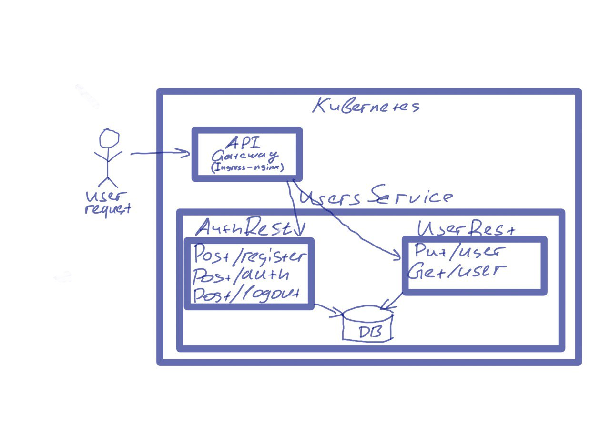

## Описание:
Манифесты kubernetes, запускается crud приложениес базой данных, в котором настроена аутентификация, на которую накатываются миграции, метрики собираются prometheus и их можно
посмотреть в grafana. 

## Postman tests
Тесты постман находятся в папке postman_test.

## Схема архитектуры

## Запуск приложения:
#### helm repo add prometheus-community https://prometheus-community.github.io/helm-charts

#### helm repo update

#### helm install stack prometheus-community/kube-prometheus-stack -f C:\projects\msa-training\kubernetes-crud-prometeus\prometheus.yml

#### helm install nginx ingress-nginx/ingress-nginx --namespace default -f C:\projects\msa-training\kubernetes-crud-prometeus\nginx_ingress.yaml --set controller.metrics.enabled=true --set controller.metrics.serviceMonitor.enabled=true --set controller.metrics.serviceMonitor.additionalLabels.release="kube-prometheus-stack"

#### helm install users .

#### kubectl port-forward service/prometheus-operated  9090

#### kubectl port-forward service/stack-grafana  9000:80